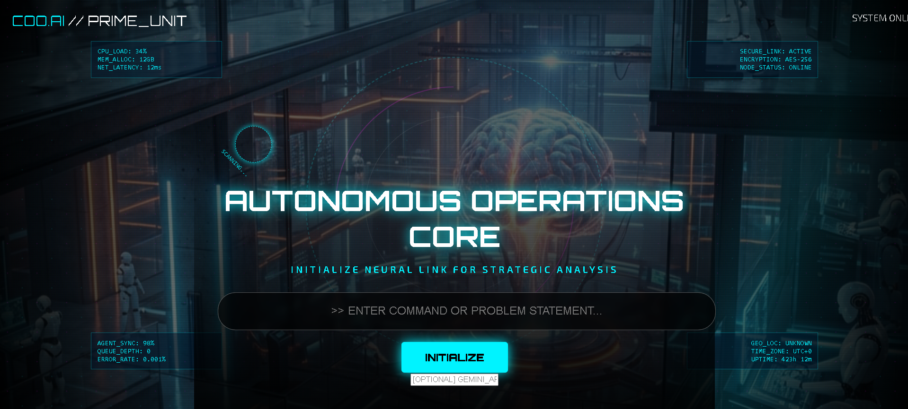
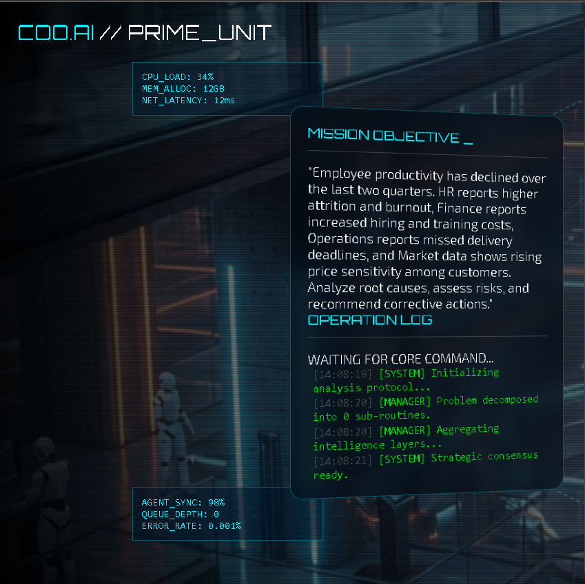
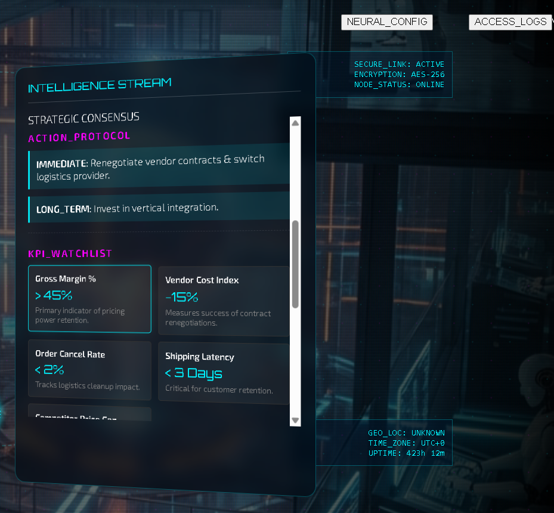
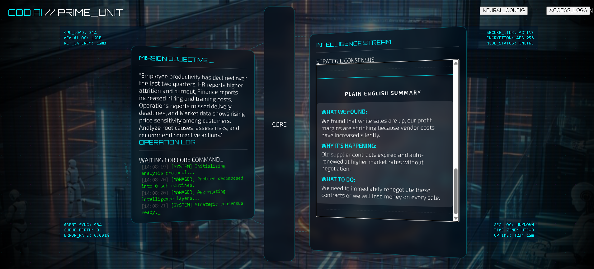

# 🤖 Multi-Agent AI Operations Platform

A **real-world Multi-Agent AI platform** designed to simulate how multiple intelligent agents collaborate to perform operational tasks such as planning, execution, monitoring, and decision optimization.

This project demonstrates **agent coordination, modular architecture, and scalable AI system design**, inspired by real enterprise AI operations platforms.

---

## 🚀 Project Overview

Modern organizations require intelligent systems that can operate autonomously, coordinate tasks, and adapt to changing conditions.  
This platform showcases how **multiple AI agents** can work together to manage workflows, analyze inputs, and make decisions collaboratively.

✔ Not a static UI  
✔ Not a single-agent system  
✔ A **multi-agent orchestration platform**

---

## 🎯 Objectives

- Simulate collaboration between multiple AI agents  
- Design a modular and scalable agent architecture  
- Demonstrate real-world AI operations workflow  
- Provide a visual and interactive interface  

---

## 🧠 Core Concepts

### 🔹 Multi-Agent Architecture
Each agent has a specific responsibility:
- Planner Agent – breaks tasks into steps  
- Executor Agent – performs assigned actions  
- Monitor Agent – observes system behavior  
- Coordinator Agent – manages inter-agent communication  

---

## ⚙️ How the System Works

1. User interacts with the web interface  
2. Input is routed to the core controller  
3. Planner agent analyzes the task  
4. Executor agents perform actions  
5. Monitor agent tracks execution  
6. Results are displayed dynamically  

---

## 🛠️ Tech Stack

### Frontend
- HTML  
- CSS  
- JavaScript  

### AI & Architecture
- Agent-based system design  
- Modular core and component architecture  

---

## 📂 Project Structure

```text
Multi-Agent-AI-Operations-Platform/
├── index.html
├── start_demo.bat
├── assets/
│   ├── drone_robo_bg.png
│   └── user_hero.png
├── css/
│   ├── style.css
│   ├── sci_fi_theme.css
│   └── custom_agent.css
├── js/
│   ├── app.js
│   ├── bundle.js
│   ├── agents/
│   ├── core/
│   └── components/
<!-- screenshots section -->
---

## 🖼️ Screenshots

### 🔹 Frontend User Interface


---

### 🔹 Problem Statement


---

### 🔹 Resolution Overview


---

### 🔹 Agent Workflow


---

### 🔹 System Architecture

